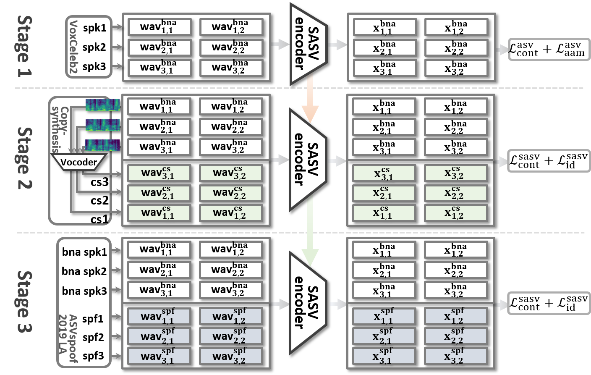

# Towards single integrated spoofing-aware speaker verification embeddings


## `Stage 1`. Speaker classification-based Pre-training.

In [Stage 1](https://github.com/sasv-challenge/ASVSpoof5-SASVBaseline/tree/main/stage1), the ability to discriminate between target and bona fide non-target speakers can be learned using the `VoxCeleb2` database which contains data collected from thousands of bona fide speakers. In this repository, we provide the pre-trained weights of the following models:

* ECAPA-TDNN:    [ecapa_tdnn.model](https://drive.google.com/file/d/1wazmfXOP5jv4Ynn3SNYhNKJs2e_z86ue/view?usp=share_link) (64MB)
* MFA_Conformer: [mfa_conformer.model](https://drive.google.com/file/d/1R8koiGMFzCRl0v8gPBYYSD21ZKOks9nm/view?usp=share_link) (89MB)
* SKA-TDNN:      [ska_tdnn.model](https://drive.google.com/file/d/1buMtltChZxdQyBqQkUQwohgqV_vubGfU/view?usp=share_link) (123MB)

| Model           | params       | SASV-EER (%)  | SV-EER (%)    | SPF-EER (%)  |
| :---:           | :---:        | :---:         | :---:         | :---:        |
| `ECAPA-TDNN`    | 16.7M        | 20.66         | 0.74          | 27.30        |
| `MFA-Conformer` | 20.9M        | 20.22         | 0.41          | 26.52        |
| `SKA-TDNN`      | 29.4M        | 16.74         | 0.38          | 22.38        |

You can evaluate the pre-trained weights using the following commands:
```bash
cd stage3

python trainSASVNet.py
        --eval \
        --test_list ./protocols/ASVspoof2019.LA.asv.eval.gi.trl.txt \
        --test_path /path/to/dataset/ASVSpoof/ASVSpoof2019/LA/ASVspoof2019_LA_eval/wav \
        --model ECAPA_TDNN \
        --initial_model /path/to/weight/ecapa_tdnn.model

python trainSASVNet.py
        --eval \
        --test_list ./protocols/ASVspoof2019.LA.asv.eval.gi.trl.txt \
        --test_path /path/to/dataset/ASVSpoof/ASVSpoof2019/LA/ASVspoof2019_LA_eval/wav \
        --model MFA_Conformer \
        --initial_model /path/to/weight/mfa_conformer.model

python trainSASVNet.py
        --eval \
        --test_list ./protocols/ASVspoof2019.LA.asv.eval.gi.trl.txt \
        --test_path /path/to/dataset/ASVSpoof/ASVSpoof2019/LA/ASVspoof2019_LA_eval/wav \
        --model SKA_TDNN \
        --initial_model /path/to/weight/ska_tdnn.model
```

## `Stage 2`.  Copy-synthesis Training.
In [Stage 2](https://github.com/sasv-challenge/ASVSpoof5-SASVBaseline/tree/main/stage2), we augment the model with the ability to discriminate between bona fide and spoofed inputs by using large-scale data generated through an oracle speech synthesis system, referred to as copy synthesis.
This repository has the copy-synthesis training using copy-synthesized data from `VoxCeleb2 dev` or `ASVspoof2019 LA train/train+dev`.


## `Stage 3`. In-domain Fine-tuning.
Even though training in Stages 1 and 2 learn to discriminate bona fide non-target and spoof non-target inputs, there is a remaining domain mismatch with the evaluation protocol. Furthermore, artefacts from the acoustic model have yet to be learned. Hence, in [Stage 3](https://github.com/sasv-challenge/ASVSpoof5-SASVBaseline/tree/main/stage3), we fine-tune the model using in-domain bona fide and spoofed data contained within the `ASVspoof2019 LA` dataset.

## `Summary`. Experimental results and pre-trained weights for several models.
|    | Stage1                         | Stage2                       | Stage3                         | SASV-EER              | SASV-EER                  | SASV-EER                   | SASV-EER                       |
|:--:| :---:                          | :---:                        | :---:                          | :---:                 | :---:                     | :---:                      | :---:                          |
|    | ASV-based<br>Pre-training      | Copy-synthesis<br>Training   | In-domain<br>Fine-tuning       | `SKA-TDNN`<br>`train` | `SKA-TDNN`<br>`train+dev` | `MFA-Conformer`<br>`train` | `MFA-Conformer`<br>`train+dev` |
|1   | -                              | -                            | `ASVspoof2019`<br>`(bna+spf)`  | [9.55](https://drive.google.com/file/d/1RFRj3IyR4MrfJ0TgikBD96k-fRtVeYoW/view?usp=sharing) | [5.94](https://drive.google.com/file/d/1xkoyIAggQkpfVhfdmxndUDxKFQZ0Kxpd/view?usp=sharing) | [11.47](https://drive.google.com/file/d/1rxpHaDdaLWyx96JQzNeKD6gHXOmlcY1I/view?usp=sharing) | [7.67](https://drive.google.com/file/d/15o5FmKeaYPElsDBf4-mq_0BobNxTfgew/view?usp=sharing) |
|2   | `VoxCeleb2`<br>`(bna)`         | -                            | -                              | - | [16.74](https://drive.google.com/file/d/1buMtltChZxdQyBqQkUQwohgqV_vubGfU/view?usp=share_link) | - | [20.22](https://drive.google.com/file/d/1R8koiGMFzCRl0v8gPBYYSD21ZKOks9nm/view?usp=share_link) |
|3   | `VoxCeleb2`<br>`(bna)`         | -                            | `ASVspoof2019`<br>`(bna+spf)`  | [2.67](https://drive.google.com/file/d/1GHv8_3ZSenvsLX22kVOvQhk7z9Naa_Ju/view?usp=sharing) | **[1.25](https://drive.google.com/file/d/1iclSQYOlthLSwMsSMn0bxQ3O3RBPPtfY/view?usp=sharing)** | [2.13](https://drive.google.com/file/d/1O4xzjNeal1cJctiR-ryGqOpCcwrhArz-/view?usp=sharing) | [1.51](https://drive.google.com/file/d/16MHbeVY8rUVcG_gLGIqnzEAIPJIAFarv/view?usp=sharing) |
|4   | -                              | `VoxCeleb2`<br>`(bna+cs)`    | -                              | - | [13.11](https://drive.google.com/file/d/1bg2Nb7ud1jL604aBwbZ7avnJlYq3Bqfl/view?usp=sharing) | - | [14.27](https://drive.google.com/file/d/1PmUFxmrtwaYIP60-eOavjO9z7ssOIlMD/view?usp=sharing) |
|5   | -                              | `VoxCeleb2`<br>`(bna+cs)`    | `ASVspoof2019`<br>`(bna+spf)`  | [2.47](https://drive.google.com/file/d/1iloOkHMydNQdEhdw6LgpTNTXJ4eDm_Vd/view?usp=sharing) | [1.93](https://drive.google.com/file/d/1uDpM2Ax_ZdtP10gzY3tDYYRnXJaLjSLQ/view?usp=sharing) | [1.91](https://drive.google.com/file/d/1WsybxklRpC_GxBwB-sBUdrrdiQhqOCDq/view?usp=sharing) | [1.35](https://drive.google.com/file/d/13kxbdBKrfOUmjbTmaeoJ-UE3yix0FqLn/view?usp=sharing) |
|6   | `VoxCeleb2`<br>`(bna)`         | `VoxCeleb2`<br>`(bna+cs)`    | -                              | - | [10.24](https://drive.google.com/file/d/10h_6Pdj3uFNkaAoqqaowARVYTandu-4K/view?usp=sharing) | - | [12.33](https://drive.google.com/file/d/1wTY40HqqcEAQctxMlc-f3_whwafS1roI/view?usp=sharing) |
|7   | `VoxCeleb2`<br>`(bna)`         | `VoxCeleb2`<br>`(bna+cs)`    | `ASVspoof2019`<br>`(bna+spf)`  | **[1.83](https://drive.google.com/file/d/1mH17hznSCLp1puQ3yu8TTv3e5P_q-C95/view?usp=sharing)** | [1.56](https://drive.google.com/file/d/1L8YwLMtcBT1TLm1TuqY5_HWgRhN9HvSu/view?usp=sharing) | **[1.19](https://drive.google.com/file/d/1tfnU3lS4LAdR2BJ2Ffz99h5XGqufrxOx/view?usp=sharing)** | **[1.06](https://drive.google.com/file/d/1zrkwidxymAGm7e6NEyMbsNhqAMkR6e3-/view?usp=sharing)** |
|8   | -                              | `ASVspoof2019`<br>`(bna+cs)` | -                              | [13.10](https://drive.google.com/file/d/1N1QMw3ZXHSLAtTFT2eHyKBNwBRLzNrev/view?usp=sharing) | [10.49](https://drive.google.com/file/d/1vk3vnLp7YzuI_axBei6V5Bo4_Eit4pqf/view?usp=sharing) | [13.63](https://drive.google.com/file/d/1WEkHbZFWjZWdTy1vGIZcKa-DZhFDdpTj/view?usp=sharing) | [12.48](https://drive.google.com/file/d/1jufUxG9LxSVEr-yfC_NoZuXu_sn6R26G/view?usp=sharing) |
|9   | -                              | `ASVspoof2019`<br>`(bna+cs)` | `ASVspoof2019`<br>`(bna+spf)`  | [9.57](https://drive.google.com/file/d/1q_bLYCJ4P2AeRsFZP3gtwy-_Yr9JaNXf/view?usp=sharing) | [6.17](https://drive.google.com/file/d/1FYdJ0PiIsdughZvxY2L1Zt1C6BUb7amc/view?usp=sharing) | [13.46]() | [10.11](https://drive.google.com/file/d/1Xkoun51C7OHMsWYNLjxbCtaR0TAeB4VX/view?usp=sharing) |
|10  | `VoxCeleb2`<br>`(bna)`         | `ASVspoof2019`<br>`(bna+cs)` | -                              | [5.62](https://drive.google.com/file/d/19yi9XieL152KzixYURBOiC_3tYTtcLQ-/view?usp=sharing) | [4.93](https://drive.google.com/file/d/1a4FDiTqL3gYVzlBp-332qJ6FqnzI5Nx9/view?usp=sharing) | [9.31](https://drive.google.com/file/d/1PaJi31EN8ZDqwr5Ug3XjxkkxJf_Q8ACy/view?usp=sharing) | [8.32](https://drive.google.com/file/d/1HxQJ4D9SGSRBXlKMYbUC6769EpGYOWO_/view?usp=sharing) |
|11  | `VoxCeleb2`<br>`(bna)`         | `ASVspoof2019`<br>`(bna+cs)` | `ASVspoof2019`<br>`(bna+spf)`  | [2.48](https://drive.google.com/file/d/1OBToHqE2kVuzv77zbCZie3tpDxpxh7A0/view?usp=sharing) | [1.44](https://drive.google.com/file/d/1q7BuiR1MM6xGXWJiaKSJiuFY8eWKBdi0/view?usp=sharing) | [2.72](https://drive.google.com/file/d/186AvkLm3Aws6ZwAOvrZKa-E-YTBiPaiP/view?usp=sharing) | [1.76](https://drive.google.com/file/d/1_M2-QZrhRPHQQkye-UNr0GeV8Pc5DbU3/view?usp=sharing) |

You can download each pre-trained weight from the above links:

## Citation
If you utilize this repository, please cite the following paper,
```
@inproceedings{chung2020in,
  title={In defence of metric learning for speaker recognition},
  author={Chung, Joon Son and Huh, Jaesung and Mun, Seongkyu and Lee, Minjae and Heo, Hee Soo and Choe, Soyeon and Ham, Chiheon and Jung, Sunghwan and Lee, Bong-Jin and Han, Icksang},
  booktitle={Proc. Interspeech},
  year={2020}
}
```

```
@inproceedings{jung2022pushing,
  title={Pushing the limits of raw waveform speaker recognition},
  author={Jung, Jee-weon and Kim, You Jin and Heo, Hee-Soo and Lee, Bong-Jin and Kwon, Youngki and Chung, Joon Son},
  booktitle={Proc. Interspeech},
  year={2022}
}
```

```
@inproceedings{mun2022frequency,
  title={Frequency and Multi-Scale Selective Kernel Attention for Speaker Verification},
  author={Mun, Sung Hwan and Jung, Jee-weon and Han, Min Hyun and Kim, Nam Soo},
  booktitle={Proc. IEEE SLT},
  year={2022}
}
```